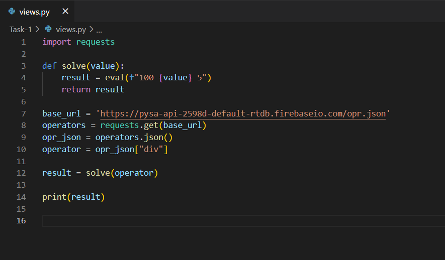
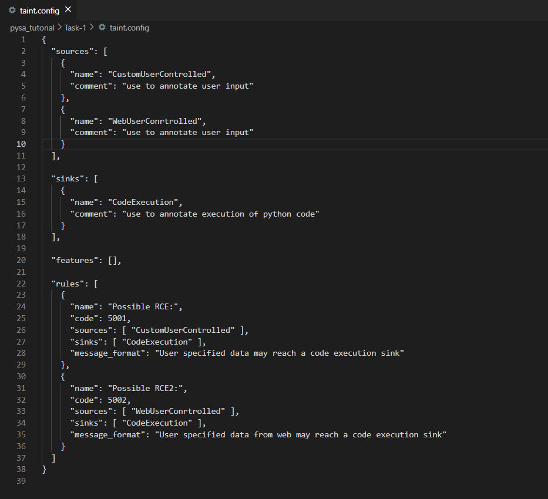
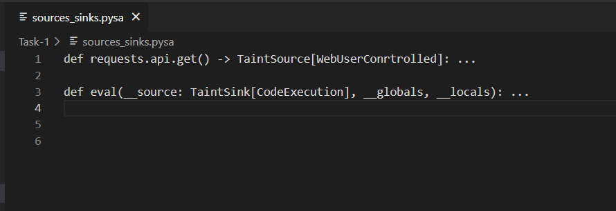
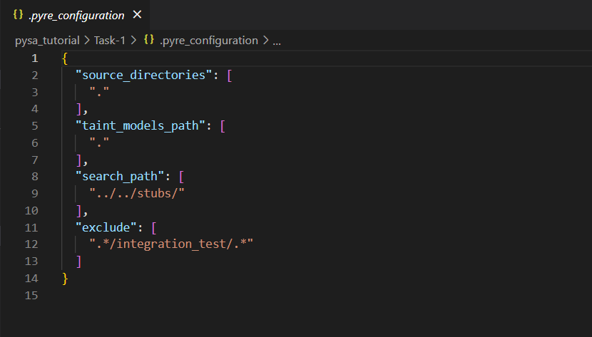

# Task - 1

In this task you are provided with the Pysa sample code and its configuration files. Your task is to follow the tutorial below and answer the questions on the google form provided to you.

There are three subtasks provided in this task. Follow the instructions of each of the subtask and answer the questions on the google form after each subtask.

## Files for this task

### `views.py`
<br>
<p align="left">
  
</p>

<br>

### `taint.config`
<br>
<p align="left">
  
</p>

<br>

### `sources_sinks.pysa`
<br>
<p align="left">
  
</p>

<br>

### `.pyre_configuration`
<br>
<p align="left">
  
</p>

## Subtask - 1 (Looking at the files identify vulnerability manually)

1. There are four files provided to you in this task (views.py, taint.config, sources_sinks.pysa, .pyre_configuration). 

2. Go through all these files in detail (just by looking the files) and answer the questions on the google form.

<br>

## Subtask - 2 (Use PySa (static analyzer) to detect vulnerabilities)

Now you can use the PySa and run the static analyzer, and with the help of the generated output try to answer the questions

1. Go to task - 1 directory, if you are in the root directory

   ```
   cd Pysa-Experiment/pysa_tutorial
   ```

2. Activate the virtual environment

      ```
      source tutorial/bin/activate
      ```

3. After activating the virtual environment, go to the first task (Task - 1)

   ```
   cd Task-1
   ```

4. Now run the analyzer using any of the below command

   ```
   pyre analyze
   ```
   or
   ```
   pyre analyze --no-verify
   ```

<br>

## Subtask - 3 (Use PySa Output (static analyzer) along with Visual studio code debugger (Dynamic Debugger) to detect vulnerabilities)

Now you can use the PySa along with the Visual studio code debugger, and with the help of the PySa generated output and tracking dataflow using dynamic debugger try to answer the questions

1. Download and Install Visual studio Code from the below link, If you have not installed it already.

   ```
   https://code.visualstudio.com/download
   ```

2. After the installation, open the visual studio code.

3. In the navigation bar, go to File -> Open Folder (Open the project directory folder stored in your PC)

4. On the left navigation bar, Expand pysa-tutorial -> Task-1, then open views.py file from Task-1 directory.

5. On the leftmost navigation look for Run and Debug option and click on it.

6. A dropdown list will appear, select "Debug the currently active Python file" from the dropdown


